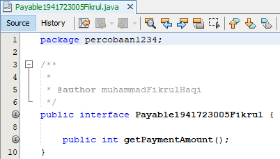

# Laporan Praktikum #10 ‑ Polimorfisme

## Kompetensi

a. Memahami konsep dan bentuk dasar polimorfisme

b. Memahami konsep virtual method invication

c. Menerapkan polimorfisme pada pembuatan heterogeneous collection

d. Menerapkan polimorfisme pada parameter/argument method

e. Menerapkan object casting untuk meng-ubah bentuk objek

## Ringkasan Materi

## Praktikum
## Percobaan 1 - Bentuk dasar Polimorfisme

link kode program : [Employee](../../src/10_Polimorfisme/Employee1941723005Fikrul.java)


link kode program : [Payable](../../src/10_Polimorfisme/Payable1941723005Fikrul.java)



link kode program : [InternshipEmployee](../../src/10_Polimorfisme/InternshipEmployee1941723005Fikrul.java)


link kode program : [PermanentEmployee](../../src/10_Polimorfisme/PermanentEmployee1941723005Fikrul.java)


link kode program : [ElectricityBill](../../src/10_Polimorfisme/ElectricityBill1941723005Fikrul.java)


link kode program :[Tester1](../../src/10_Polimorfisme/Tester11941723005Fikrul.java)


### Pertanyaan
1. Class apa sajakah yang merupakan turunan dari class Employee?
2. Class apa sajakah yang implements ke interface Payable?
3. Perhatikan class Tester1, baris ke-10 dan 11. Mengapa e, bisa diisi dengan objek pEmp (merupakan objek dari class PermanentEmployee) dan objek iEmp (merupakan objek dari class InternshipEmploye) ?
4. Perhatikan class Tester1, baris ke-12 dan 13. Mengapa p, bisa diisi dengan objek pEmp (merupakan objek dari class PermanentEmployee) dan objek eBill (merupakan objek dari class ElectricityBill) ?
5. Coba tambahkan sintaks:
p = iEmp;
e = eBill; 
pada baris 14 dan 15 (baris terakhir dalam method main ! Apa yang menyebabkan error?
6. Ambil kesimpulan tentang konsep/bentuk dasar polimorfisme!

### Jawaban
1. InternshipEmployee.java dan PermanentEmployee.java
2. PermanentEmployee.java dan ElectricityBill.java
3. Karena pEmp dan iEmp merupakan objek yang class-nya (PermanentEmployee dan InternshipEmployee) sudah meng-extends class Employee yang meng-instance-kan objek e sehingga dalam instansiasi referensinya untuk e=pEmp dan e=iEmp tidak error.
4. Karena pEmp dan eBill memang merupakan objek yang class-nya (PermanentEmployee dan ElectricityBill) sudah meng-implemets interface Payable yang meng-instance-kan objek p sehingga dalam instansiasi referensinya untuk p=pEmp dan p=eBill tidak error.
5. 

Tidak adanya relasi antar dua kelas pada p=iEmp dan e=eBill yang dapat memungkinkan untuk instansiasi yang mereferensikan kelas super dengan extends atau implements interface pada salah satu class di setiap baris pereferensiannya pada baris 14 dan 15(di jobsheet).
6. Polimorfisme dengan objek atau banyak objek pada suatu class baru bisa diterapkan apabila class tersebut memiliki hirearki penurunan class atau implementasi interface sehingga mewujudkan banyak wujud dari class yang diturunkan atau interface yang diimplementasikan.

## Percobaan 2 - Virtual method invocation

link kode program : [Tester2](../../src/10_Polimorfisme/Tester21941723005Fikrul.java)


### Pertanyaan
1. Perhatikan class Tester2 di atas, mengapa pemanggilan e.getEmployeeInfo() pada baris 8 dan pEmp.getEmployeeInfo() pada baris 10 menghasilkan hasil sama?
2. Mengapa pemanggilan method e.getEmployeeInfo() disebut sebagai pemanggilan method virtual (virtual method invication), sedangkan pEmp.getEmployeeInfo() tidak?
3. Jadi apakah yang dimaksud dari virtual method invocation? Mengapa disebut virtual?

### Jawaban
1. karena objek e sudah di-nishbatkan kepada objek pEmp sesuai yang terdapat pada kode baris ke 7 (di jobsheet) sehingga untuk pemanggilan method e.getEmployeeInfo() yang memiliki statement method yang berbeda dari statement method pEmp.getEmployee menjalankan fungsi method virtual yang hasil pemanggilan dua method dengan statement berbeda tersebut adalah sama dengan overrided method result.
2. karena method e.getEmployeeInfo() mengalami generalisasi method sehingga statementnya berubah dan disebut virtual method karena antara method yang
dikenali oleh compiler dan method yang dijalankan oleh JVM berbeda sedangkan pEmp.getEmployeeInfo tidak demikian.
3. virtual method invocation adalah method yang terjadi ketika ada pemanggilan overriding method
dari suatu objek polimorfisme. Disebut virtual karena antara method yang
dikenali oleh compiler dan method yang dijalankan oleh JVM berbeda.

## Percobaan 3 – Heterogenous Collection

link kode program : [Tester3](../../src/10_Polimorfisme/Tester31941723005Fikrul.java)


### Pertanyaan
1. Perhatikan array e pada baris ke-8, mengapa ia bisa diisi dengan
objek-objek dengan tipe yang berbeda, yaitu objek pEmp (objek dari
PermanentEmployee) dan objek iEmp (objek dari
InternshipEmployee) ?
2. Perhatikan juga baris ke-9, mengapa array p juga biisi dengan objek objek
dengan tipe yang berbeda, yaitu objek pEmp (objek dari
PermanentEmployee) dan objek eBill (objek dari
ElectricityBilling) ?
3. Perhatikan baris ke-10, mengapa terjadi error?

### Jawaban

1. karena array e
dideklarasikan dari class Employee(superclass dari pEmp dan iEmp).
2. karena array p
dideklarasikan dari class Payable(interface yang implemented oleh pEmp dan eBill).
3. karena array e2 dideklarasikan dari class Employee (superclass dari pEmp dan iEmp) yang bukan superclass dari eBill sehingga heterogenous collection tidak bisa berlaku pada instansiasi array e2 dan terjadi error.

## Percobaan 4– Argumen polimorfisme, instanceof dan casting objek

link kode program : [Tester4](../../src/10_Polimorfisme/Tester31941723005Fikrul.java)


### Pertanyaan
1. Perhatikan class Tester4 baris ke-7 dan baris ke-11, mengapa pemanggilan ow.pay(eBill) dan ow.pay(pEmp) bisa dilakukan, padahal jika diperhatikan method pay() yang ada di dalam class Owner memiliki argument/parameter bertipe Payable? Jika diperhatikan lebih detil eBill merupakan objek dari ElectricityBill dan pEmp merupakan objek dari PermanentEmployee?
2. Jadi apakah tujuan membuat argument bertipe Payable pada method pay() yang ada di dalam class Owner?
3. Coba pada baris terakhir method main() yang ada di dalam class Tester4 ditambahkan perintah ow.pay(iEmp);


Mengapa terjadi error?

4. Perhatikan class Owner, diperlukan untuk apakah sintaks p instanceof ElectricityBill pada baris ke-6 ?
5. Perhatikan kembali class Owner baris ke-7, untuk apakah casting objek disana (ElectricityBill eb = (ElectricityBill) p) diperlukan ? Mengapa objek p yang bertipe Payable harus di-casting ke dalam objek eb yang bertipe ElectricityBill ?

### Jawaban
1. karena 

``` java
if(p instanceof ElectricityBill1941723005Fikrul){
            ElectricityBill1941723005Fikrul eb = (ElectricityBill1941723005Fikrul) p;
            System.out.println(""+eb.getBillInfo());   
        }else if(p instanceof PermanentEmployee1941723005Fikrul){
            PermanentEmployee1941723005Fikrul pe = (PermanentEmployee1941723005Fikrul) p;
            pe.getEmployeeInfo();
            System.out.println(""+pe.getEmployeeInfo());
        }
```

code di atas berada di dalam method pay yang menjadikan method ow.pay(eBill) dan ow.pay(pEmp) downcasting sehingga tipenya diubah ke eb dan pe.

2. agar Payable bisa di-downcast menjadi subclass.
3. 

karena iEmp yang dideklarasikan dari InternshipEmployee belum di-downcast dari Payable.
4. untuk menspesifikkan instansiasi p yang akan dideklarasikan di main.
5. Iya, agar superclass Payable dapat diubah ke tipe subclass.

## Tugas


link kode program : [Zombie1941723005Fikrul](../../src/10_Polimorfisme/Zombie1941723005Fikrul.java)


link kode program : [JumpingZombie1941723005Fikrul](../../src/10_Polimorfisme/Zombie1941723005Fikrul.java)


link kode program : [WalkingZombie1941723005Fikrul](../../src/10_Polimorfisme/Zombie1941723005Fikrul.java)


link kode program : [Barrier1941723005Fikrul](../../src/10_Polimorfisme/Zombie1941723005Fikrul.java)


link kode program : [Plant1941723005Fikrul](../../src/10_Polimorfisme/Zombie1941723005Fikrul.java)


link kode program : [Destroyable1941723005Fikrul](../../src/10_Polimorfisme/Zombie1941723005Fikrul.java)


link kode program : [MainTugas1941723005Fikrul](../../src/10_Polimorfisme/MainTugas1941723005Fikrul.java)

