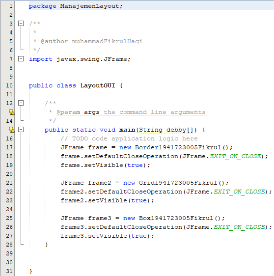
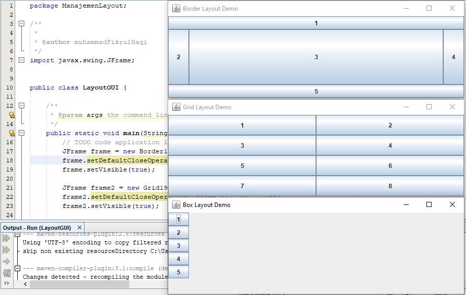
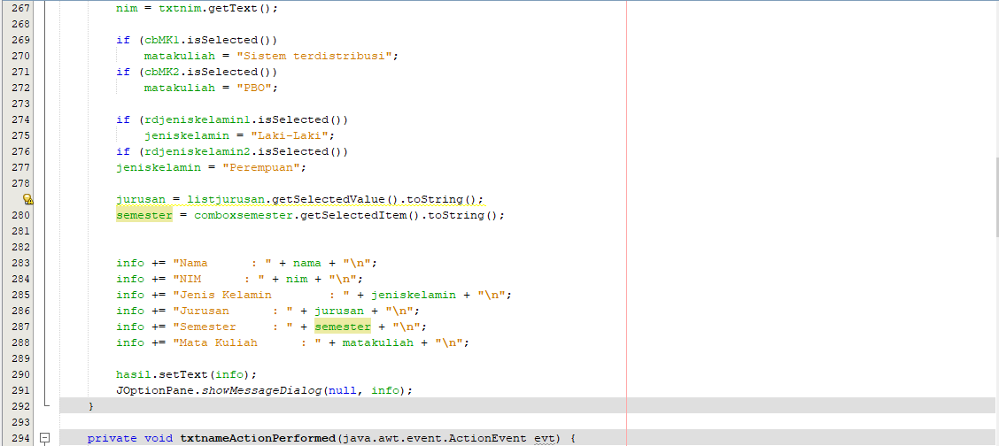

# Laporan Praktikum #11 - GUI

## Kompetensi

1. Membuat aplikasi Graphical User Interface sederhana dengan bahasa pemrograman java;
2. Mengenal komponen GUI seperti frame, label, textfield, combobox, radiobutton, checkbox, textarea, menu, serta table;
3. Menambahkan event handling pada aplikasi GUI.

## Ringkasan Materi

Menemui masalah dalam memasukkan value yang benar pada combobox dan radiobutton pada percobaan 4. Selain itu alhamdulillaah, belum ada persoalan yang tidak terpecahkan.

## Praktikum
## Percobaan 1: JFrame HelloGUI

link kode program : [HelloGui](../../src/11_GUI/HelloGui1941723005Fikrul.java)

## Percobaan 2: Menangani Input Pada GUI

link kode program : [MyInputForm](../../src/11_GUI/MyInputForm1941723005Fikrul.java)

link kode program : [Main Program](../../src/11_GUI/NewMain.java)

### Pertanyaan
a) Modifikasi kode program dengan menambahkan JButton baru untuk melakukan fungsi perhitungan penambahan, sehingga ketika button di klik (event click) maka akan menampilkan hasil penambahan dari nilai A dan B

### Jawaban

a) 

## Percobaan 3: Manajemen Layout

link kode program : [Border](../../src/11_GUI/Border1941723005Fikrul.java)

link kode program : [Grid](../../src/11_GUI/Grid1941723005Fikrul.java)

link kode program : [Box](../../src/11_GUI/Box1941723005Fikrul.java)

link kode program : [LayoutGUI](../../src/11_GUI/LayoutGUI.java)

### Pertanyaan
a) Apa perbedaan dari Grid Layout, Box Layout dan Border Layout?
b) Apakah fungsi dari masing-masing kode berikut?

### Jawaban

a) Grid Layout adalah tata letak berdasarkan jaring jaring yang simetris dan memenuhi layout isi tampilan, Box Layout adalah tata letak yang berbentuk box atau kotak dan bisa di-custom posisinya, Border Layout adalah layout yang batasannya bisa diatur dengan varian ukuran yang berbeda-beda.

b) Menambahkan frame = Border, frame2 = Grid, dan frame3 = Box beserta fungsi Default Close Operation untuk menutup operasi dan fungsi mengatur Visible(true) / nampak.

## Percobaan 4: Membuat GUI Melalui IDE Netbeans

link kode program : [Swing](../../src/11_GUI/Swing1941723005Fikrul.java)

link kode program : [Swing JForm](../../src/11_GUI/Swing1941723005Fikrul.form)

### Pertanyaan
a) Apakah fungsi dari kode berikut

b) Mengapa pada bagian logika checkbox dan radio button digunakan multiple if ?
c) Lakukan modifikasi pada program untuk melakukan menambahkan inputan berupa alamat dan berikan fungsi pemeriksaan pada nilai Alamat tersebut jika belum diisi dengan menampilkan pesan peringatan

### Jawaban

a) memposting Runnable di akhir daripada daftar event Swings maka akan diproses setelah semua event GUI sebelumnya diproses.

b) karena ada dua kondisi dalam penginputan value berbeda yang terdapat pada checkbox (cbMK1.isSelected dan cbMK2.isSelected) dan radio button (rdjeniskelamin1.isSelected dan rdjeniskelamin2.isSelected) tersebut.

c) 

## Percobaan 5: JTabPane, JTtree, JTable

link kode program : [Swing2](../../src/11_GUI/Swing21941723005Fikrul.java)
link kode program : [Swing2 JForm](../../src/11_GUI/Swing21941723005Fikrul.form)

### Pertanyaan

a) Apa kegunaan komponen swing JTabPane, JTtree, pada percobaan 5?
b) Modifikasi program untuk menambahkan komponen JTable pada tab Halaman 1 dan tab Halaman 2

### Jawaban

a) JTabbedPane digunakan untuk beralih di antara sekelompok komponen dengan mengklik tab dengan judul atau ikon yang diberikan.
JTree digunakan untuk menampilkan data struktur pohon atau data hierarkis, memiliki 'root node' paling atas yang merupakan induk untuk semua node di pohon.

b) 

## Assigment
Buatlah Sebuah Program yang mempunyai fungsi seperti kalkulator (mampu menjumlahkan, mengurangkan, mengalikan dan membagikan. Dengan tampilan seperti berikut.

link kode program : [Calculator1941723005](../../src/11_GUI/JavaCalculator.java)

## Kesimpulan

Swing API adalah seperangkat Komponen GUI yang dapat dikembangkan untuk memudahkan kehidupan pengembang untuk membuat Aplikasi Front End / GUI berbasis JAVA. Itu dibangun di atas AWT API dan bertindak sebagai pengganti AWT API, karena ia memiliki hampir setiap kontrol yang terkait dengan kontrol AWT. Komponen swing mengikuti arsitektur Model-View-Controller untuk memenuhi kriteria berikut.

- Satu API harus mencukupi untuk mendukung banyak tampilan dan nuansa.

- API harus digerakkan oleh model sehingga API tingkat tertinggi tidak diharuskan memiliki data.

- API adalah untuk menggunakan model Java Bean sehingga Builder Tools dan IDE dapat memberikan layanan yang lebih baik kepada pengembang untuk digunakan.

## Pernyataan Diri

Saya menyatakan isi tugas, kode program, dan laporan praktikum ini dibuat oleh saya sendiri. Saya tidak melakukan plagiasi, kecurangan, menyalin/menggandakan milik orang lain.

Jika saya melakukan plagiasi, kecurangan, atau melanggar hak kekayaan intelektual, saya siap untuk mendapat sanksi atau hukuman sesuai peraturan perundang-undangan yang berlaku.

Ttd,

***(Muhammad Fikrul Haqi)***