# Laporan Praktikum #12 - Collection(List, Set, Map) dan Database

## Kompetensi
1. Memahami cara penyimpanan objek menggunakan Collection dan Map.
2. Mengetahui pengelompokan dari Collection.
3. Mengetahui perbedaan dari interface Set, List dan Map.
4. Mengetahui penggunaan class-class dari interface Set, List, dan Map.
5. Memahami koneksi database menggunakan JDBC dan JDBC API

## Ringkasan Materi

Collection adalah suatu objek yang bisa digunakan untuk menyimpan sekumpulan objek.
Objek yang ada dalam Collection disebut elemen. Collection menyimpan elemen yang bertipe
Object, sehingga berbagai tipe object bisa disimpan dalam Collection. Class-class mengenai
Collection tergabung dalam Java Collection Framework. Class-class Collection diletakkan
dalam package java.util dan mempunyai dua interface utama yaitu Collection

JDBC API merupakan Java Database Connectivity Application Programming Interface (
JDBC API). Pada dasarnya JDBC API terdiri dari satu set kelas dan interface yang digunakan
untuk berinteraksi dengan database dari aplikasi Java. Umumnya, JDBC API melakukan 3
(tiga) fungsi berikut :
- Membangun koneksi antara aplikasi Java dan database
- Membangun dan mengeksekusi query
- Memproses hasil

## Praktikum
## Percobaan 1 (Set)

link kode program : [DemoHashSet](../../src/12_Java_API/DemoHashSet194173005Fikrul.java)

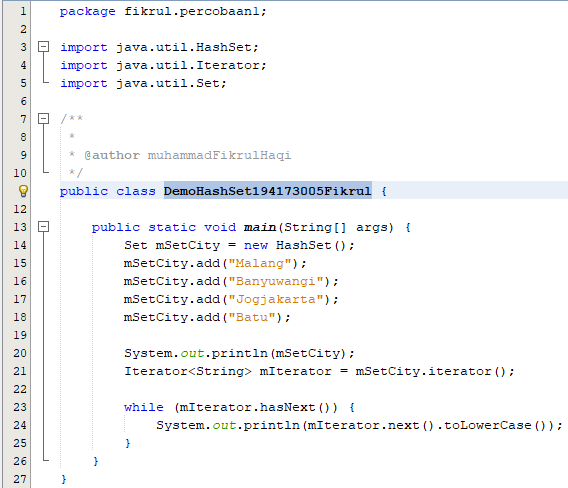
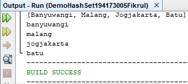

### Pertanyaan
1. Apakah fungsi import java.util.*; pada program diatas!
2. Pada baris program keberapakah yang berfungsi untuk menciptakan object HashSet?
3. Apakah fungsi potongan program dibawah ini pada percobaan 1!


4. Tambahkan set.add(“Malang”); kemudian jalankan program! Amati hasilnya dan jelaskan
mengapa terjadi error!
5. Jelaskan fungsi potongan program dibawah ini pada percobaan 1!


### Jawaban

1. untuk menambahkan semua yang ada library java util

2. baris ke-14

3. untuk menambah elemen yang ada pada mSetCity

4. karena objek set belum diinstansiasi

5. berfungsi mengulang format penambahan objek

## Percobaan 2 (List)

link kode program : [ArrayList](../../src/12_Java_API/ArrayList194173005Fikrul.java)

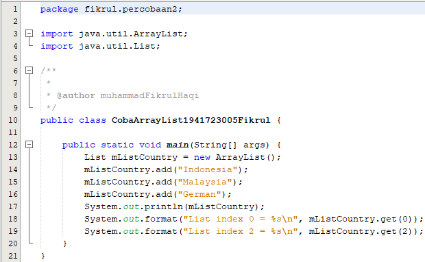

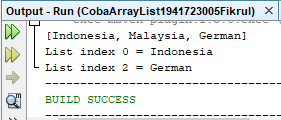

### Pertanyaan
1. Apakah fungsi potongan program dibawah ini!


2. Ganti potongan program pada soal no 1 menjadi sebagai berikut


Kemudian jalankan program tersebut!
3. Jelaskan perbedaan menampilkan data pada ArrayList menggunakan potongan program pada
soal no 1 dan no 2!

### Jawaban

1. menambah index sesuai inputan

2. 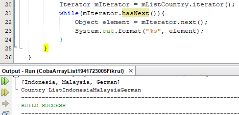

3. pada code 1 menampilkan detail list sedangkan code 2 tidak

## Percobaan 3 (Map)

link kode program : [DemoHashMap](../../src/12_Java_API/DemoHashMap194173005Fikrul.java)

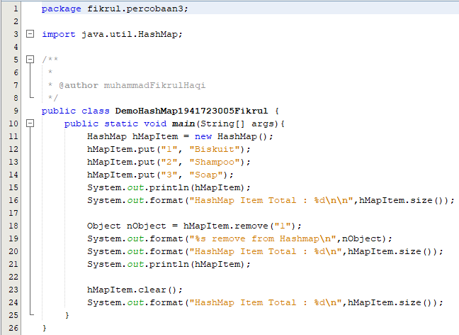

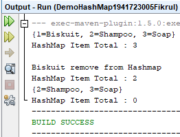

### Pertanyaan
1. Jelaskan fungsi hMapItem.put("1","Biskuit") pada program!
2. Jelaskan fungsi hMapItem.size() pada program!
3. Jelaskan fungsi hMapItem.remove("1") pada program!
4. Jelaskan fungsi hMapItem.clear() pada program!
5. Tambahkan kode program yang di blok pada program yang sudah anda buat!


### Jawaban

1. mengambil elemen array

2. mengatur ukuran hMapItem

3. menghapus "1" pada hMapItem

4. membersihkan field pada hMapItem

5. 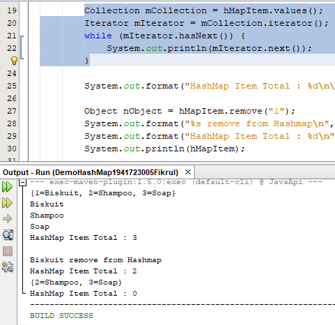

## Percobaan 4 (Implementasi ArrayList dalam GUI)

link kode program : [Mahasiswa](../../src/12_Java_API/Mahasiswa194173005Fikrul.java)

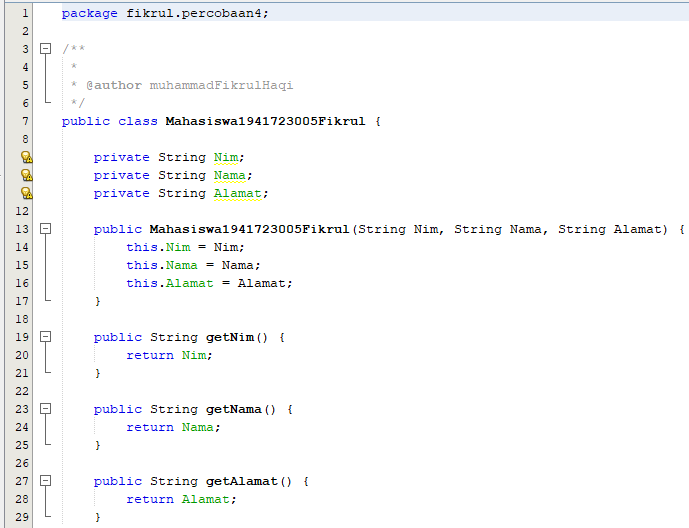

link kode program : [InputData](../../src/12_Java_API/InputData194173005Fikrul.java)

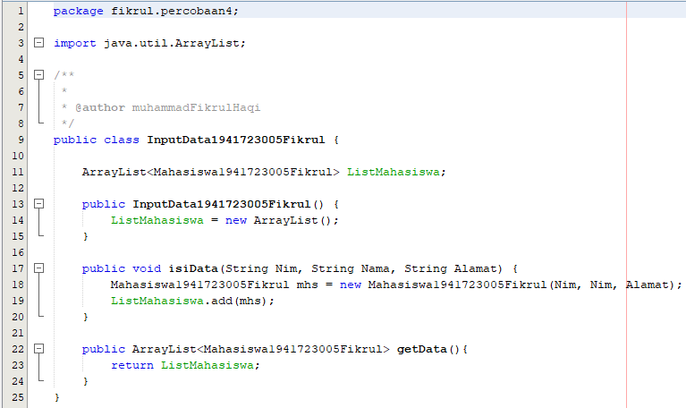

link kode program : [TampilGui](../../src/12_Java_API/TampilGui194173005Fikrul.java)

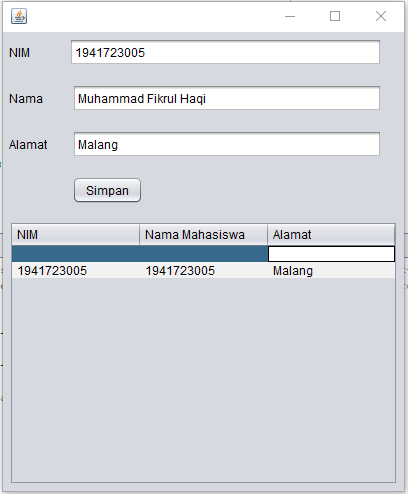

## Percobaan 5 (Aplikasi Biodata)

link kode program : [FormKoneksi](../../src/12_Java_API/FormKoneksi194173005Fikrul.java

### Pertanyaan
5. Setelah menambah code pada action button klik, coba jalankan program dan tambahkan
data. Apakah program berhasil menambahkan data? Jika tidak apakah penyebabnya.
6. Jelaskan maksud source code untuk melakukan insert data diatas?
9. Jelaskan alur dari method ambil_data_tabel?
10. Buat fungsi untuk merefresh sehingga data yang baru dapat ditampilkan pada tabel.

### Jawaban

5. Karena belum ada code insert data untuk setiap kolom pada tabel

6. melakukan insert data berdasarkan urutan kolom pada tabel

9. 
``` java 
private void ambil_data_tabel() {
model.getDataVector().removeAllElements();
model.fireTableDataChanged();
try {
buka_koneksi();
Statement s = koneksi.createStatement();
String sql = "Select * from anggota";
ResultSet r = s.executeQuery(sql);
while (r.next()) {
Object[] o = new Object[4];
o[0] = r.getString("id");
o[1] = r.getString("nama");
o[2] = r.getString("alamat");
o[3] = r.getString("telp");
model.addRow(o);
}
r.close();
s.close();
} catch (SQLException e) {
JOptionPane.showMessageDialog(this,"Terjadi kesalahan " + e.getMessage());
}
} 
```
buka koneksi -> r.close -> s.close

10. 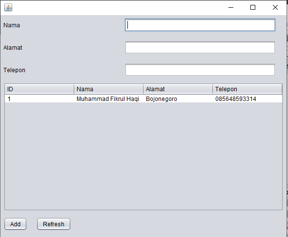

## Kesimpulan

JDBC adalah koneksi dalam java yang berperan untuk
- Membangun koneksi antara aplikasi Java dan database
- Membangun dan mengeksekusi query
- Memproses hasil

## Pernyataan Diri

Saya menyatakan isi tugas, kode program, dan laporan praktikum ini dibuat oleh saya sendiri. Saya tidak melakukan plagiasi, kecurangan, menyalin/menggandakan milik orang lain.

Jika saya melakukan plagiasi, kecurangan, atau melanggar hak kekayaan intelektual, saya siap untuk mendapat sanksi atau hukuman sesuai peraturan perundang-undangan yang berlaku.

Ttd,

***(Muhammad Fikrul Haqi)***