# Laporan Praktikum #15 - Unit Testing

## Kompetensi

1. Memahami konsep dan fungsi unit testing
2. Menerapkan unit testing dengan JUnit pada program sederhana.
3. Menerapkan unit testing dengan JUnit pada progam yang terkoneksi database

## Ringkasan Materi

Unit Testing dalam implementasinya lebih detail dalam interprestasi permasalahan dalam test hasil program dibandingkan dengan Konvensional Testing.

## Percobaan 1: Dasar Unit Testing

link kode program : [MessagePocessor](../../src/15_Unit_Testing/MessageProcessor1941723005Fikrul.java)
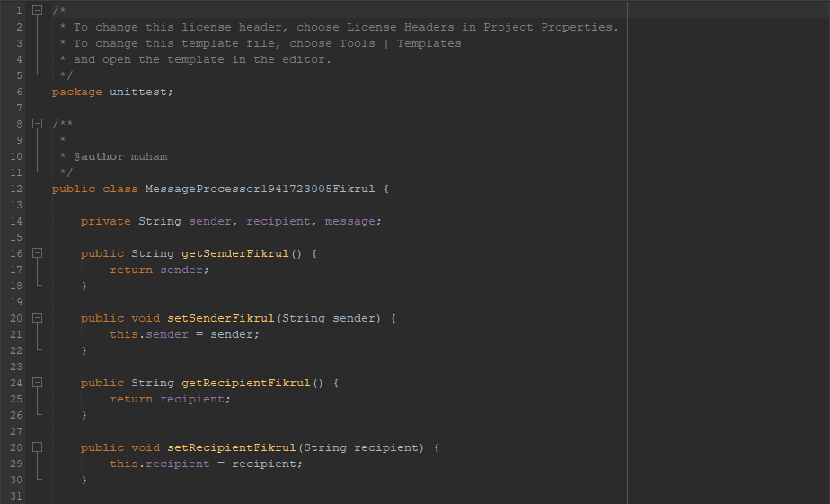
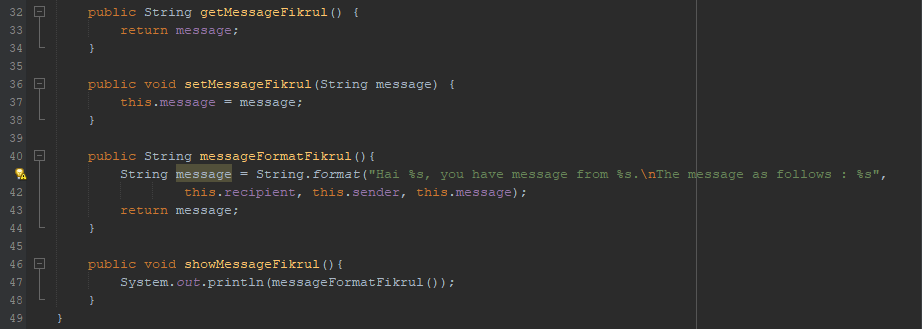

link kode program : [LearnUnitTesting](../../src/15_Unit_Testing/LearnUnitTesting1941723005Fikrul.java)
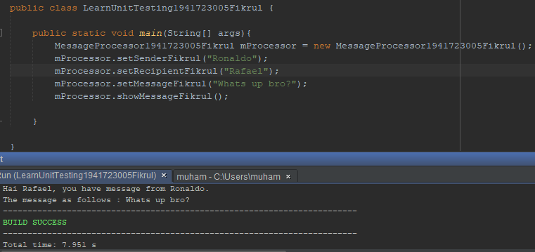

link kode program : [MessageProcessorTest](../../src/15_Unit_Testing/MessageProcessorTest1941723005Fikrul.java)
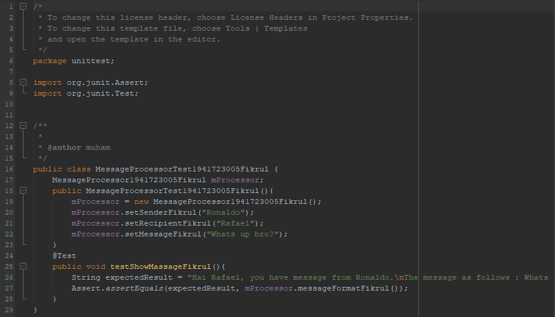

link kode program : [TestRunnerMessageProcessor](../../src/15_Unit_Testing/TestRunnerMessageProcessor1941723005Fikrul.java)
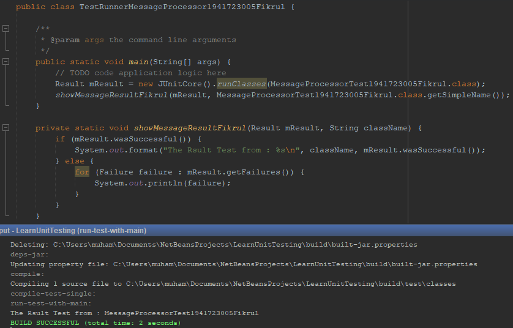

## Percobaan 2: Unit Testing dengan Test Case

link kode program : [DBHelper](../../src/15_Unit_Testing/DBHelper1941723005Fikrul.java)

link kode program : [Kategori](../../src/15_Unit_Testing/Kategori1941723005Fikrul.java)

link kode program : [KategoriTest](../../src/15_Unit_Testing/KategoriTest1941723005Fikrul.java)
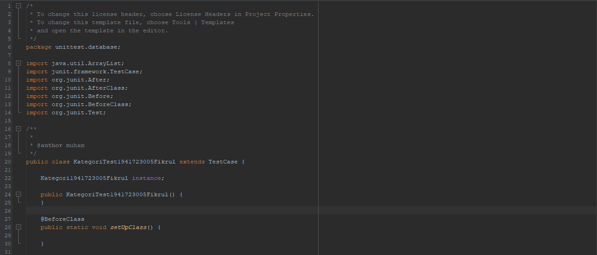
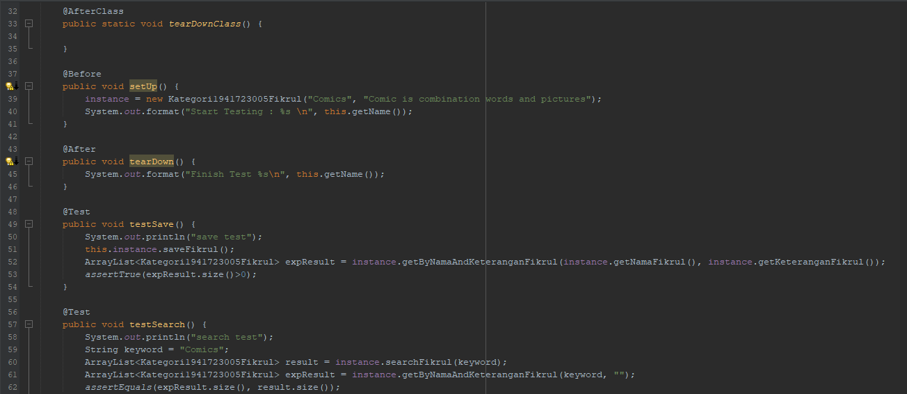

link kode program : [TestRunnerKategori](../../src/15_Unit_Testing/TestRunnerKategori1941723005Fikrul.java)
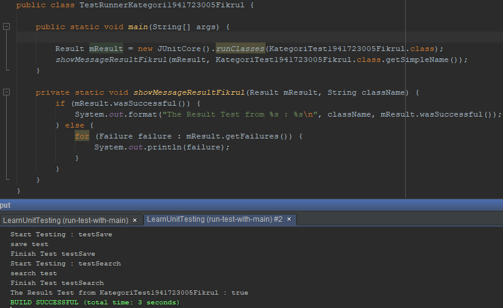

## Tugas:
1. Buat test case untuk percobaan kedua pada jobsheet ke 14.

## Jawab
1. 
link kode program : [DBHelper](../../src/15_Unit_Testing/DBHelper1941723005Fikrul.java)

link kode program : [Anggota](../../src/15_Unit_Testing/Anggota1941723005Fikrul.java)

link kode program : [AnggotaTest](../../src/15_Unit_Testing/AnggotaTest1941723005Fikrul.java)
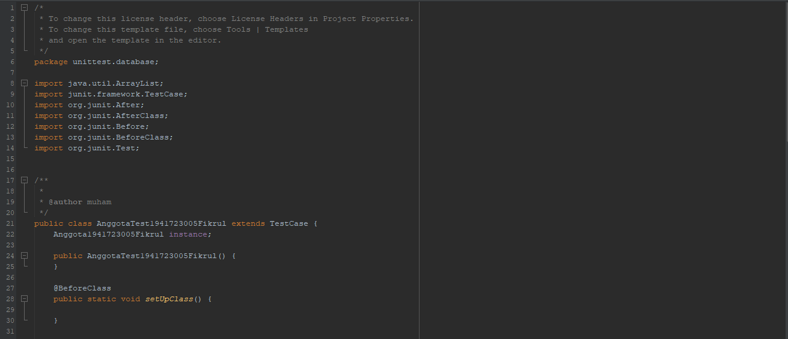
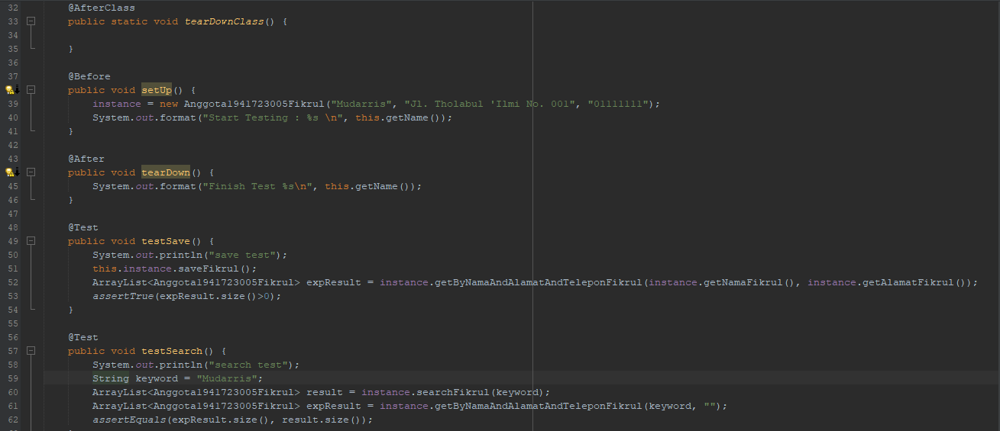

link kode program : [TestRunnerAnggota](../../src/15_Unit_Testing/TestRunnerAnggota1941723005Fikrul.java)
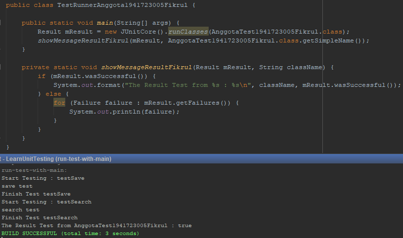

## Kesimpulan

- Unit Testing biasanya dibuat oleh programmer untuk memastikan kode yang dibuatnya sesuai dengan konsep yang direncanakan
- Apabila ada bug Unit Testing berperan untuk memisahkan setiap bagian dari kode program agar lebih ringan dalam debug
- Unit Testing dilakukan untuk testing program sebelum integrasi
- Metode pengujian dari Unit Testing adalah pengujian ke dalam beberapa kasus pengujian.

## Pernyataan Diri

Saya menyatakan isi tugas, kode program, dan laporan praktikum ini dibuat oleh saya sendiri. Saya tidak melakukan plagiasi, kecurangan, menyalin/menggandakan milik orang lain.

Jika saya melakukan plagiasi, kecurangan, atau melanggar hak kekayaan intelektual, saya siap untuk mendapat sanksi atau hukuman sesuai peraturan perundang-undangan yang berlaku.

Ttd,

***(Muhammad Fikrul Haqi)***