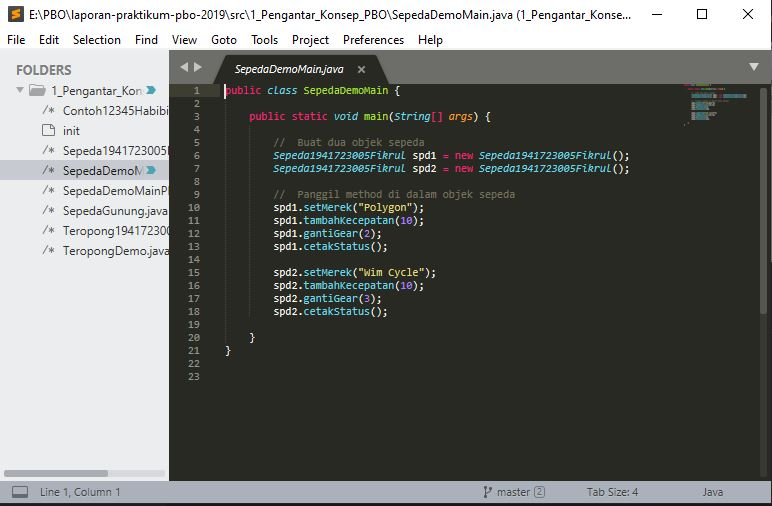
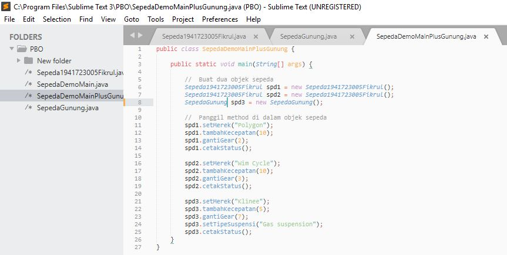
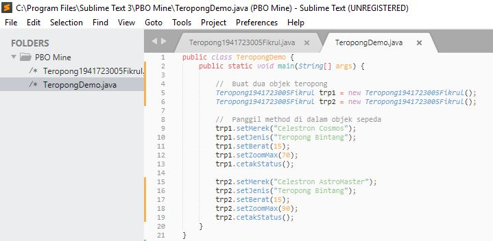

# Laporan Praktikum #1 - Pengantar Konsep PBO

## Kompetensi

Setelah menempuh materi percobaan ini, mahasiswa mampu mengenal: 
1. Perbedaan paradigma berorientasi objek dengan paradigma struktural 
2. Konsep dasar PBO 

## Ringkasan Materi

Memahami cara memasukkan attribute dan method serta melakukan inheritance yang benar dalam OOP.

## Percobaan

### Percobaan 1

link kode program : [Sepeda1941723005Fikrul.java](../../src/1_Pengantar_Konsep_PBO/Sepeda1941723005Fikrul.java)

link kode program : [SepedaDemoMain.java](../../src/1_Pengantar_Konsep_PBO/SepedaDemoMain.java)

### Percobaan 2

link kode program : 
[Sepeda1941723005Fikrul.java](../../src/1_Pengantar_Konsep_PBO/Sepeda1941723005Fikrul.java)

link kode program : 
[SepedaGunung.java](../../src/1_Pengantar_Konsep_PBO/SepedaGunung.java)

link kode program : 
[SepedaDemoMainPlusGunung.java](../../src/1_Pengantar_Konsep_PBO/SepedaDemoMainPlusGunung.java)

## Pertanyaan

1. Sebutkan dan jelaskan aspek-aspek yang ada pada pemrograman berorientasi objek!
 2. Apa yang dimaksud dengan object dan apa bedanya dengan class? 
 3. Sebutkan salah satu kelebihan utama dari pemrograman berorientasi objek dibandingkan dengan pemrograman struktural!
 4. Pada class Sepeda, terdapat state/atribut apa saja? 
 5. Tambahkan atribut warna pada class Sepeda.
 6. Mengapa pada saat kita membuat class SepedaGunung, kita tidak perlu membuat class nya dari nol? 
 
 ## Jawaban
 
 1. Enkapsulasi : Penentuan hak akses terhadap entitas atau method dalam class agar mudah dalam melaksanakan program tanpa tercampur program lain yaitu : public, private, dan protected.
	Inheritansi : Pewarisan class ke subclass atau cabang super class yang masih memiliki abstraksi dari entitas class induk contoh : Sepeda memiliki keturunan SepedaGunung 
	Polimorfism : Penggabungan sub class dengan kemajemukan entitas dengan yang ada di induk yaitu super class contoh : CaraBerburu dalam class HewanKarnivora memiliki kemajemukan : Sendiri dan Berkelompok
	Abstraksi : Persepsi keseluruhan atau umum hasil interpretasi untuk class dari objek contoh : Karpet, Starting computer, laptop dan lain lain.
 2. Objek adalah benda sedangkan class adalah identitas atau segala entitas yang ada pada benda tersebut.
 3. Lebih praktis dan simpel dalam mem push data.
 4. Merk, Gear, dan Kecepatan.
 5. (img/soalno.5.JPG)
 6. Karena cukup menurunkan dengan extends dan secara otomatis sudah didapatkan atribut dalam abstraksi atau komponen sepeda secara umum. 

## Tugas

Teropong1941723005Fikrul link kode program : 
[Teropong1941723005Fikrul.java](../../src/1_Pengantar_Konsep_PBO/Teropong1941723005Fikrul.java)
TeropongDemo link kode program : 
[TeropongDemo.java](../../src/1_Pengantar_Konsep_PBO/TeropongDemo.java)

## Kesimpulan

Dengan pertemuan #1 ini Alhamdulillaah saya bisa membuat class beserta menjalankan program di dalamnya menggunakan bahasa java dan membuat inheritance dengan Pemrograman Berbasis Objek

## Pernyataan Diri

Saya menyatakan isi tugas, kode program, dan laporan praktikum ini dibuat oleh saya sendiri. Saya tidak melakukan plagiasi, kecurangan, menyalin/menggandakan milik orang lain.

Jika saya melakukan plagiasi, kecurangan, atau melanggar hak kekayaan intelektual, saya siap untuk mendapat sanksi atau hukuman sesuai peraturan perundang-undangan yang berlaku.

Ttd,

***Muhammad Fikrul Haqi***
