# Laporan Praktikum #2 - Class Dan Object

## Kompetensi

1) Mahasiswa dapat memahami deskripsi dari class dan object
2) Mahasiswa memahami implementasi dari class
3) Mahasiswa dapat memahami implementasi dari attribute
4) Mahasiswa dapat memahami implementasi dari method
5) Mahasiswa dapat memahami implementasi dari proses instansiasi
6) Mahasiswa dapat memahami implementasi dari try-catch
7) Mahasiswa dapat memahami proses pemodelan class diagram menggunakan UML

## Ringkasan Materi

Secara singkat class adalah abstraksi dari sebuah object (nyata ataupun tdk nyata) (roger s pressman). Apabila kita ingin membuat class mahasiswa, maka kita perlu melakukan abstraksi (mengindikasi bagian – bagian penting yang merepresentasikan benda itu sendiri) dari object mahasiswa itu sendiri.

## Percobaan

## Percobaan 1

### Membuat Class Diagram

### Soal

1. Gambarkan desain class diagram dari studi kasus 1!, 
2. Sebutkan Class apa saja yang bisa dibuat dari studi kasus 1!, 
3. Sebutkan atribut beserta tipe datanya yang dapat diidentifikasi dari masing-masing class dari studi kasus 1! 
4. Sebutkan method-method yang sudah anda buat dari masing-masing class pada studi kasus 1!

### Jawab

1. 
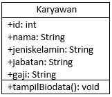

2. - Class Karyawan
   - Class KaryawanMain

3. - idKaryawan : int
   - namaKaryawan : int
   - jenisKelamin : String
   - jabatan : String
   - gaji : int

4. -tampilDataKaryawan():

## Percobaan 2

### Membuat dan Mengakses Anggota Suatu Class

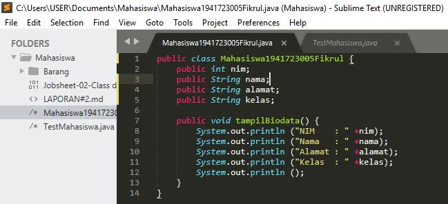

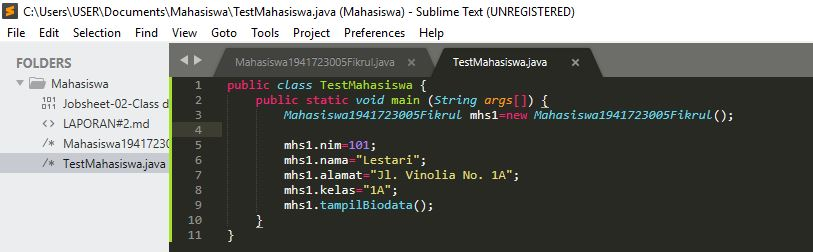

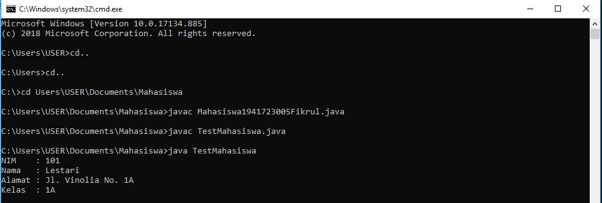

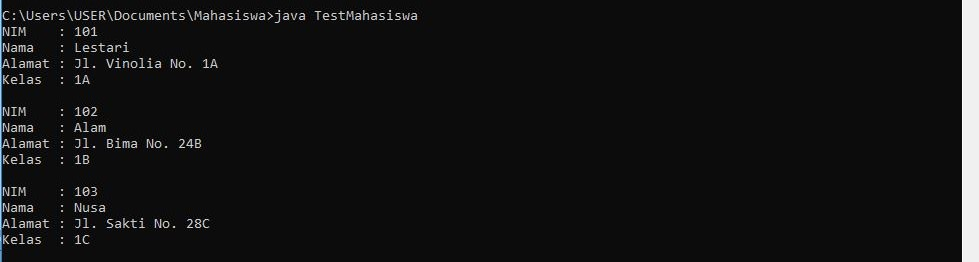

link kode program : [Class Mahasiswa](../../src/2_Class_dan_Object/Mahasiswa1941723005Fikrul.java)

link kode program : [Class TestMahasiswa](../../src/2_Class_dan_Object/TestMahasiswa.java)

### Soal

7. Jelaskan pada bagian mana proses pendeklarasian atribut pada program diatas!
8. Jelaskan pada bagian mana proses pendeklarasian method pada program diatas!
9. Berapa banyak objek yang di instansiasi pada program diatas!
10. Apakah yang sebenarnya dilakukan pada sintaks program “mhs1.nim=101” ?
11. Apakah yang sebenarnya dilakukan pada sintaks program “mhs1.tampilBiodata()”? 
12. Instansiasi 2 objek lagi pada program diatas!

### Jawab

7. public class Mahasiswa1941723005Fikrul{
    public int nim;
    public String nama;
    public String alamat;
    public String kelas;
}

8. public void  tampilBiodata(){
    System.out.println("Nim       : "+nim);
    System.out.println("Nama      : "+nama);
    System.out.println("Alamat    : "+alamat);
    System.out.println("Kelas     : "+kelas);
}

9. object yang di instansi hanya ada 1 yaitu 
    Mahasiswa1941723005Fikrul mhs1=new Mahasiswa1941723005Fikrul();

10. menginput data nim

11. memanggil method tampilBiodata(); untuk menampilkan biodata mahasiswa

12. 
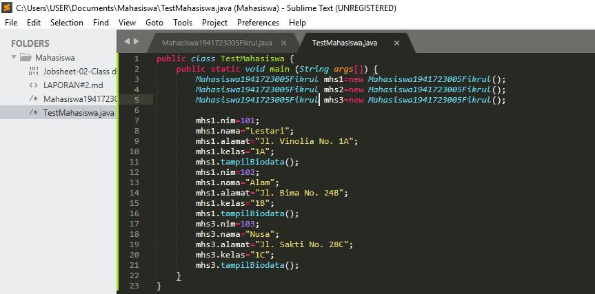

## Percobaan 3

### Menulis method yang memiliki argument/parameter dan memiliki return

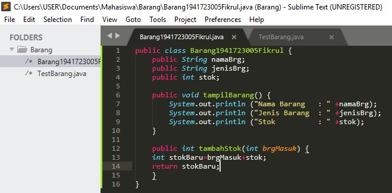

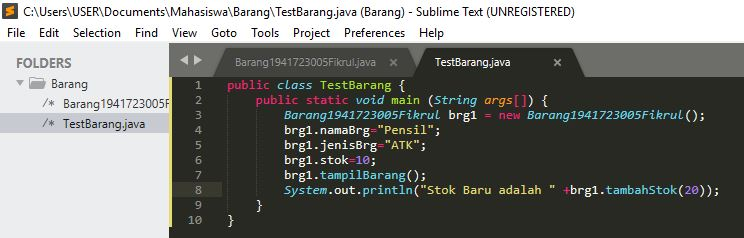

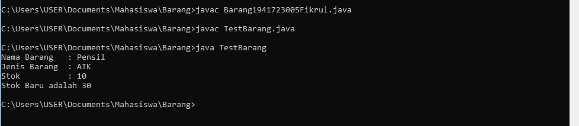

link kode program : [Class Barang](../../src/2_Class_dan_Object/Barang1941723005Fikrul.java)

link kode program : [Class TestBarang](../../src/2_Class_dan_Object/TestBarang.java)

Soal
7. Apakah fungsi argumen dalam suatu method?
8. Ambil kesimpulan tentang kegunaan dari kata kunci return , dan kapan suatu method harus memiliki return!

Jawab

7. Memberi nilai yang akan dieksekusi dalam method tersebut.

8. Return di gunakan untuk tipe data int yang berfungsi untuk mengembalikan data int.

## Tugas
 

1. 
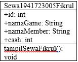

2.
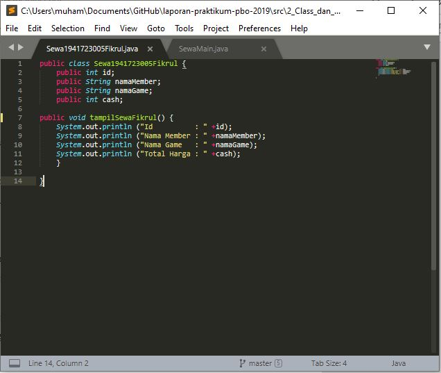

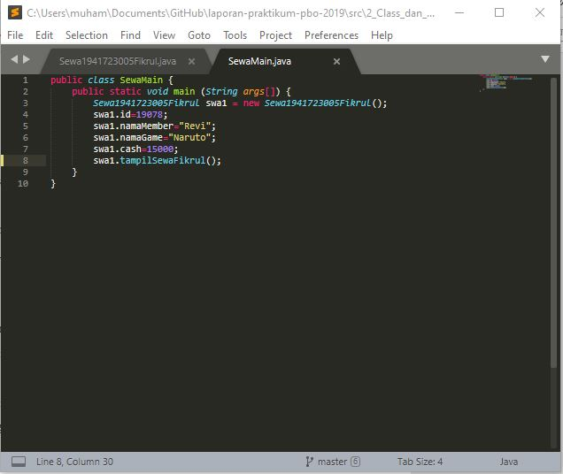

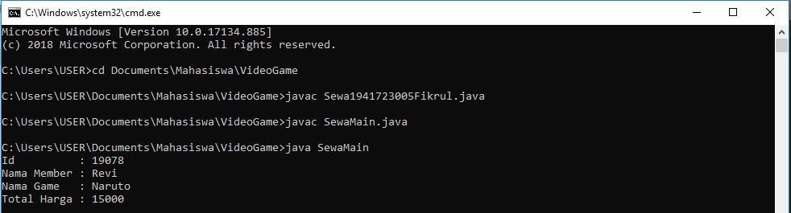

link kode program : [Class Sewa](../../src/2_Class_dan_Object/Sewa1941723005Fikrul.java)

link kode program : [Class SewaMain](../../src/2_Class_dan_Object/SewaMain.java)

3. 
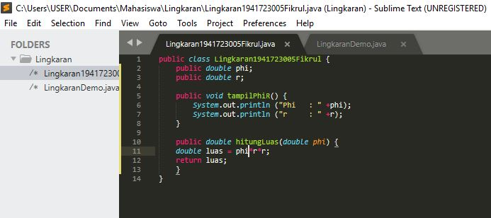

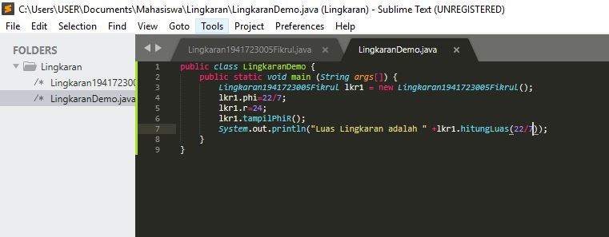

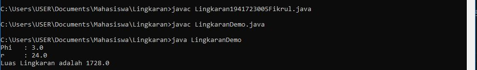

link kode program : [Class Lingkaran](../../src/2_Class_dan_Object/Lingkaran1941723005Fikrul.java)

link kode program : [Class LingkaranDemo](../../src/2_Class_dan_Object/LingkaranDemo.java)

4. 
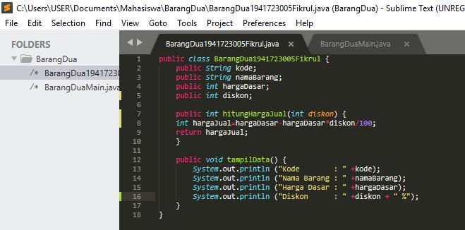

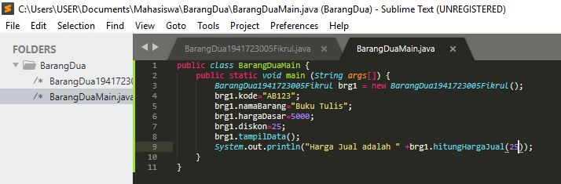

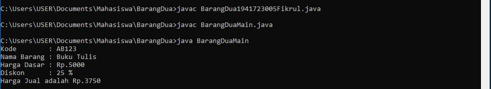

link kode program : [Class BarangDua](../../src/2_Class_dan_Object/BarangDua1941723005Fikrul.java)

link kode program : [Class BarangDuaMain](../../src/2_Class_dan_Object/BarangDuaMain.java)

## Kesimpulan

• Class adalah abstraksi dari sebuah object.
• Intansiasi objek meliputi penginputan semua atribut dan pelaksanaan method yang dinginkan.
• Method bisa memiliki argumen yang menjadi tambahan input dalam program.

## Pernyataan Diri

Saya menyatakan isi tugas, kode program, dan laporan praktikum ini dibuat oleh saya sendiri. Saya tidak melakukan plagiasi, kecurangan, menyalin/menggandakan milik orang lain.

Jika saya melakukan plagiasi, kecurangan, atau melanggar hak kekayaan intelektual, saya siap untuk mendapat sanksi atau hukuman sesuai peraturan perundang-undangan yang berlaku.

Ttd,

***(Muhammad Fikrul Haqi)***