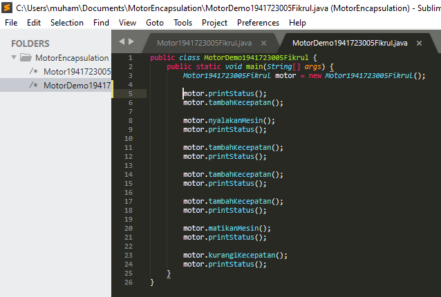
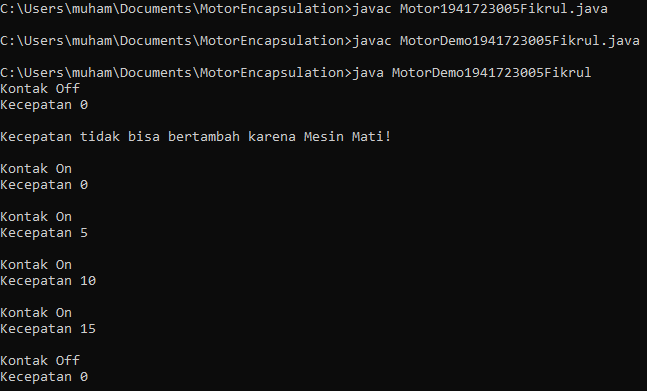
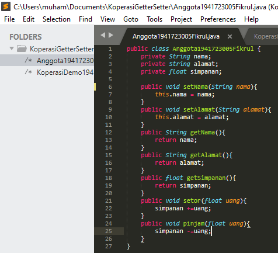

# Laporan Praktikum #3 - Enkapsulasi Pada Pemrograman Berorientasi Objek 

## Kompetensi

1. Konstruktor
2. Akses Modifier
3. Atribut/method pada class
4. Intansiasi atribut/method 
5. Setter dan getter
6. Memahami notasi pada UML Class Diagram 

## Ringkasan Materi

untuk keseluruhan dalam menyelesaikan tugas yang di berikan dosen tidak ada masalah, mulai terbiasa dengan cara pengiriman 

## Percobaan

### Percobaan 1 - Enkapsulasi 

Contoh link kode program : [Program 1](../../src/3_Enkapsulasi/Motor1941723005Fikrul.java)

Contoh link kode program : [Program 2](../../src/3_Enkapsulasi/MotorDemo1941723005Fikrul.java)

### Percobaan 2 - Access Modifier

.PNG)

Contoh link kode program : [Program 1](../../src/3_Enkapsulasi/Motor1941723005Fikrul.java)

Contoh link kode program : [Program 2](../../src/3_Enkapsulasi/MotorDemo1941723005.java)

### Pertanyaan
Soal

1. Pada class TestMobil, saat kita menambah kecepatan untuk pertama kalinya, mengapa
muncul peringatan “Kecepatan tidak bisa bertambah karena Mesin Off!”?  
2. Mengapat atribut kecepatan dan kontakOn diset private?  
3. Ubah class Motor sehingga kecepatan maksimalnya adalah 100!

Jawab
1. Karena method tambahKecepatan hanya bisa dijalankan ketika method nyalakanMesin yang digunakan untuk menyalakan mesin sudah dipanggil (kontakOn) sehingga yang muncul adalah else yaitu “Kecepatan tidak bisa bertambah karena Mesin Mati!”
2. Agar atribut kecepatan dan kontak0n tidak bisa diakses oleh class lain dan mensetting atribut kecepatan dan kontakOn pada awal MotorDemo
3. 

### Percobaan 3 - Getter dan Setter

file Program percobaan 3 jadi satu di percobaan 4

### Percobaan 4 - Konstruktor, Instansiasi
(  )

Contoh link kode program : [Program 1](../../src/3_Enkapsulasi/Anggota1941723005Fikrul.java)

Contoh link kode program : [Program 2](../../src/3_Enkapsulasi/KoperasiDemo1941723005Fikrul.java)

### Pertanyaan
Soal
1. Apa yang dimaksud getter dan setter?
2. Apa kegunaan dari method getSimpanan()?
3. Method apa yang digunakan untuk menambah saldo?
4. Apa yand dimaksud konstruktor?
5. Sebutkan aturan dalam membuat konstruktor?
6. Apakah boleh konstruktor bertipe private?
7. Kapan menggunakan parameter dengan passsing parameter?
8. Apa perbedaan atribut class dan instansiasi atribut?
9. Apa perbedaan class method dan instansiasi method?
    
### Jawab

1. mengambil dan mengisi data dalam atribut yang private access.
2. untuk menampilkan jumlah simpanan 
3. public void setor(float uang){
		simpanan +=uang;
	}
4. method khusus yang akan dieksekusi pada saat pembuatan objek.
5. biasanya untuk inisialisasi data pada objek.
6. tidak, karena konstruktor akan dieksekusi saat pembuatan objek.
7. saat akan menentukan/memberikan suatu nilai atau merubah suatu nilai pada method/fungsi pada saat di jalankan.
8. atribut class adalah atribut yang belum di beri nilai dan bisa bersifat private sedangkan itansiasi atribut adalah pemberian nilai pada atribut.
9. class method adalah method yang belum diisi nilai.

## Tugas
 

1. 

                  file program tugas no satu, jadi satu di tugas no 3

2. karena pada method setAge() terdapat kondisi jika newAge>30 maka output nilai yang muncul adalah 30 maka jika diinput nilai 35 yang muncul tetaplah 30.

3. 

Contoh link kode program : [Program 1](../../src/3_Enkapsulasi/EncapDemo1941723005Fikrul.java)

Contoh link kode program : [Program 2](../../src/3_Enkapsulasi/EncapTest1941723005Fikrul.java)

4. 

     
         File program no 4 ada di tugas no 6 karena programnya saling berhubungan
5. 

         File program no 5 ada di tugas no 6 karena programnya saling berhubungan

6. 

Contoh link kode program : [Program 1](../../src/3_Enkapsulasi/Anggota1941723005Fikrul.java)

Contoh link kode program : [Program 2](../../src/3_Enkapsulasi/TestKoperasi1941723005Fikrul.java)

## Kesimpulan

•	Dari percobaan diatas, telah dipelajari kosep dari enkapsulasi, kontruktor, access modifier yang terdiri dari 4 jenis yaitu public, protected, default dan private. 
• Konsep atribut atau method class yang ada di dalam blok code class dan konsep instansiasi atribut atau method. 
• Cara penggunaan getter dan setter beserta fungsi dari getter dan setter. 
• Dan juga telah dipelajari atau memahami notasi UML

## Pernyataan Diri

Saya menyatakan isi tugas, kode program, dan laporan praktikum ini dibuat oleh saya sendiri. Saya tidak melakukan plagiasi, kecurangan, menyalin/menggandakan milik orang lain.

Jika saya melakukan plagiasi, kecurangan, atau melanggar hak kekayaan intelektual, saya siap untuk mendapat sanksi atau hukuman sesuai peraturan perundang-undangan yang berlaku.

Ttd,

***(Muhammad Fikrul Haqi)***