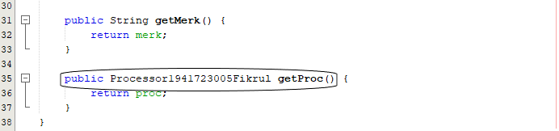
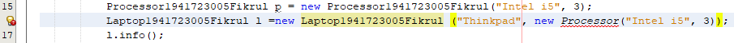
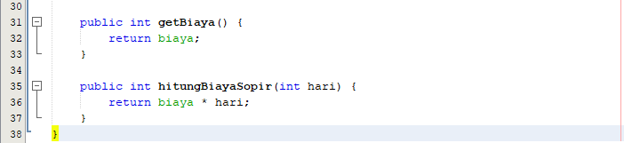
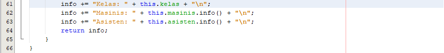
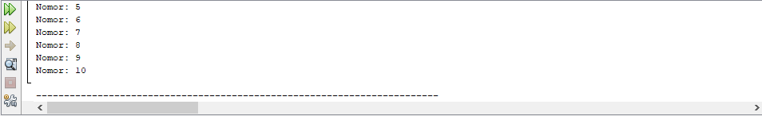

# Laporan Praktikum #4 ‑ Relasi Kelas 
 
## Kompetensi

### 1. Memahami konsep relasi kelas 
### 2. Mengimplementasikan relasi has‑a dalam program. 
 
## Ringkasan Materi

Pada kasus yang lebih kompleks, dalam suatu sistem akan ditemukan lebih dari satu class yang saling memiliki keterkaitan antara class satu dengan yang lain. Pada percobaan‑percobaan sebelumnya, mayoritas kasus yang sudah dikerjakan hanya fokus pada satu class saja. Pada jobsheet ini akan dilakukan percobaan yang melibatkan beberapa class yang saling berelasi. Jenis relasi has‑a ini yang akan dicontohkan pada percobaan di jobsheet ini. Apabila dilihat lebih rinci lagi, relasi tersebut disebut juga dengan agregasi (has-a). Relasi antar kelas yang lain adalah dependensi (uses-a) dan inheritance (is-a). Diperlukan inisiatif mandiri dari tiap mahasiswa untuk memperdalam jenis relasi lain terutama yang tidak dibahas pada mata kuliah ini. 
 
## Percobaan 
 
## Percobaan 1 
 
 link kode program : [Class Processor](../../src/4_Relasi_Class/Processor1941723005Fikrul.java)

link kode program : [Class Laptop](../../src/4_Relasi_Class/Laptop1941723005Fikrul.java)

link kode program : [MainPercobaan1](../../src/4_Relasi_Class/MainPercobaaan1.java)

 
## Pertanyaan 

1. Di dalam class Processor dan class Laptop , terdapat method setter dan getter untuk masing‑masing atributnya. Apakah gunanya method setter dan getter tersebut ? 
2. Di dalam class Processor dan class Laptop, masing‑masing terdapat konstruktor default dan konstruktor berparameter. Bagaimanakah beda penggunaan dari kedua jenis konstruktor tersebut !
3. Perhatikan class Laptop, di antara 2 atribut yang dimiliki (merk dan proc), atribut manakah yang bertipe object ? 
4. Perhatikan class Laptop, pada baris manakah yang menunjukan bahwa class Laptop memiliki relasi dengan class Processor ? 
5. Perhatikan pada class Laptop , Apakah guna dari sintaks proc.info() ? 
6. Pada class MainPercobaan1, terdapat baris kode: Laptop l = new Laptop("Thinkpad", p);. Apakah p tersebut ? Dan apakah yang terjadi jika baris kode tersebut diubah menjadi: Laptop l = new Laptop("Thinkpad", new Processor("Intel i5", 3)); Bagaimanakah hasil program saat dijalankan, apakah ada perubahan ? 

## Jawab

1. Memberi (setter) atau mengambil (getter) nilai pada objek processor dan laptop.

2. Konstruktor default untuk instansiasi tanpa parameter sedangkan konstruktor berparameter sebaliknya.

3. proc

4. 

5. Menggunkan method info dalam class Processor

6. 

Terjadi warning karena sudah dilakukan instansiasi objek processor sebelumnya yaitu pada line 16 yang diatur dalam konstruktor : 

public Laptop1941723005Fikrul(String merk, Processor1941723005Fikrul proc) {
	this.merk = merk;
	this.proc = proc;
    }
 
## Percobaan 2 
 
Perhatikan diagram class berikut yang menggambarkan sistem rental mobil. Pelanggan bisa menyewa mobil sekaligus sopir. Biaya sopir dan biaya sewa mobil dihitung per hari.

link kode program : [Class Mobil](../../src/4_Relasi_Class/Mobil1941723005Fikrul.java)

link kode program : [Class Sopir](../../src/4_Relasi_Class/Sopir1941723005Fikrul.java)

link kode program : [Class Pelanggan](../../src/4_Relasi_Class/Pelanggan1941723005Fikrul.java)

link kode program : [MainPercobaan2](../../src/4_Relasi_Class/MainPercobaan2.java)

## Pertanyaan 
 
1. Perhatikan class Pelanggan. Pada baris program manakah yang menunjukan bahwa class Pelanggan memiliki relasi dengan class Mobil dan class Sopir ? 
2. Perhatikan method hitungBiayaSopir pada class Sopir, serta method hitungBiayaMobil pada class Mobil. Mengapa menurut Anda method tersebut harus memiliki argument hari ?  
3. Perhatikan kode dari class Pelanggan. Untuk apakah perintah mobil.hitungBiayaMobil(hari) dan sopir.hitungBiayaSopir(hari) ? 
4. Perhatikan class MainPercobaan2. Untuk apakah sintaks p.setMobil(m) dan p.setSopir(s) ? 
5. Perhatikan class MainPercobaan2. Untuk apakah proses p.hitungBiayaTotal() tersebut ? 
6. Perhatikan class MainPercobaan2, coba tambahkan pada baris terakhir dari method main dan amati perubahan saat di‑run! 
 
    System.out.println(p.getMobil().getMerk()); 
 
    Jadi untuk apakah sintaks p.getMobil().getMerk() yang ada di dalam method main tersebut? 
 
 ## Jawab

 1. 
 
 

 2. Karena method tersebut melakukan perkalian atribut int-nya dengan hari untuk diperoleh fungsi menghitung jumlah biaya, maka harus ada argumen hari.
 
 3. Untuk me-result biaya total yaitu jumlah hari dikalikan dengan biaya masing masing class menggunakan rumus method yang ada di class mobil dan class sopir.
 
 4. Untuk memasukkan isi dari variabel m dan s ke dalam variabel p.
 
 5. Untuk menghitung total biaya.
 
 6. 
 
 
 Mengambil hasil instansiasi objek mobil dengan getMobil.get(modifier sesuai atribut dari mobil yang ingin diambil untuk ditampilkan)

## Percobaan 3 

link kode program : [Class Pegawai](../../src/4_Relasi_Class/Pegawai1941723005Fikrul.java)

link kode program : [Class KeretaApi](../../src/4_Relasi_Class/KeretaApi1941723005Fikrul.java)

link kode program : [Class Gerbong](../../src/4_Relasi_Class/MainPercobaan3.java)

## Pertanyaan 
 
1. Di dalam method info() pada class KeretaApi, baris this.masinis.info() dan this.asisten.info() digunakan untuk apa ? 
2. Buatlah main program baru dengan nama class MainPertanyaan pada package yang sama. Tambahkan kode berikut pada method main() !  
Pegawai masinis = new Pegawai("1234", "Spongebob Squarepants"); KeretaApi keretaApi = new KeretaApi("Gaya Baru", "Bisnis", masinis); 
 
System.out.println(keretaApi.info()); 
 
3. Apa hasil output dari main program tersebut ? Mengapa hal tersebut dapat terjadi ? 
4. Perbaiki class KeretaApi sehingga program dapat berjalan ! 
 
## Jawab

1. Mengisikan setiap info dari objek yang ada di class Pegawai dengan cara mengambil hasil dari fungsi info() yang ada di class Pegawai.

2. 

link kode program : [MainPertanyaan](../../src/4_Relasi_Class/MainPertanyaan.java)

3. Program tidak bisa dieksekusi karena ketidaksesuaian argumen dari method info di main dengan method info di class KeretaApi yaitu meniadakan asisten sedangkan method info() di class KeretaApi mengharuskan adanya asisten.

4. 

## Percobaan 4 
 
 link kode program : [Class Penumpang](../../src/4_Relasi_Class/Penumpang1941723005Fikrul.java)

link kode program : [Class Kursi](../../src/4_Relasi_Class/Kursi1941723005Fikrul.java)

link kode program : [Class Gerbong](../../src/4_Relasi_Class/Gerbong1941723005Fikrul.java)

link kode program : [MainPercobaan4](../../src/4_Relasi_Class/MainPercobaan4.java)

## Pertanyaan 
 
1. Pada main program dalam class MainPercobaan4, berapakah jumlah kursi dalam Gerbong A ? 
2. Perhatikan potongan kode pada method info() dalam class Kursi. Apa maksud kode tersebut ? 
 
... if (this.penumpang != null) { info += "Penumpang: " + penumpang.info() + "\n"; } ... 
 
3. Mengapa pada method setPenumpang() dalam class Gerbong, nilai nomor dikurangi dengan angka 1 ? 
4. Instansiasi objek baru budi dengan tipe Penumpang, kemudian masukkan objek baru tersebut pada gerbong dengan gerbong.setPenumpang(budi, 1). Apakah yang terjadi ? 
5. Modifikasi program sehingga tidak diperkenankan untuk menduduki kursi yang sudah ada penumpang lain ! 

## Jawab

1. 10 kursi.

2. Penambahan jika penumpang ada maka update info pada penumpang.info(). 
 
3. Karena urutan pertama array adalah 0 (nol) maka setiap input bilangan harus dikurangi 1 agar mengkonversi urutan bilangan tersebut dalam array.

4. 

setelah setPenumpang(p1, 1) info kursi 1 berubah menjadi info penumpang Budi.

5. 

## Tugas 
 
link kode program : [AnggotaHaji](../../src/4_Relasi_Class/AnggotaHaji.java)

link kode program : [BiayaHaji](../../src/4_Relasi_Class/BiayaHaji.java)

link kode program : [PaketHaji](../../src/4_Relasi_Class/PaketHaji.java)

link kode program : [TahunKeberangkatan](../../src/4_Relasi_Class/TahunKeberangkatan.java)

link kode program : [MainHaji](../../src/4_Relasi_Class/MainHajiFikrul.java)

## Kesimpulan

Dengan praktikum ini, saya akhirnya paham bagaimana cara penerapan relasi class, dan saya bisa mengimplementasikan aggregasi antar class.

## Pernyataan Diri

Saya menyatakan isi tugas, kode program, dan laporan praktikum ini dibuat oleh saya sendiri. Saya tidak melakukan plagiasi, kecurangan, menyalin/menggandakan milik orang lain.

Jika saya melakukan plagiasi, kecurangan, atau melanggar hak kekayaan intelektual, saya siap untuk mendapat sanksi atau hukuman sesuai peraturan perundang-undangan yang berlaku.

Ttd,

***(Muhammad Fikrul Haqi)***