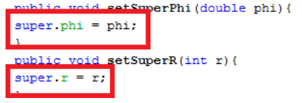
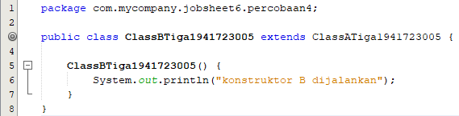
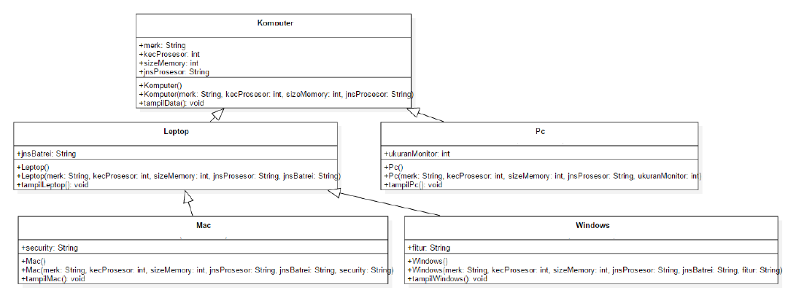

# Laporan Praktikum #6 ‑ INHERITANCE (PEWARISAN)
 
## Kompetensi

### 1. Memahami konsep dasar inheritance atau pewarisan.
### 2. Mampu membuat suatu subclass dari suatu superclass tertentu.
### 3. Mampu mengimplementasikan konsep single dan multilevel inheritance.
### 4. Mampu membuat objek dari suatu subclass dan melakukan pengaksesan terhadap atribut dan method baik yang dimiliki sendiri atau turunan dari superclassnya.
 
## Ringkasan Materi

Inheritance atau pewarisan sifat merupakan suatu cara untuk menurunkan suatu class yang lebih umum menjadi suatu class yang lebih spesifik. Inheritance adalah salah satu ciri utama suatu bahasa program yang berorientasi pada objek. Inti dari pewarisan adalah sifat reusable dari konsep object oriented. Setiap subclass akan “mewarisi” sifat dari superclass selama bersifat protected ataupun public.

## PERCOBAAN 1 (extends)

link kode program : [ClassA1941723005.java](../../src/6_Inheritance/ClassA1941723005.java)

link kode program : [ClassB1941723005.java](../../src/6_Inheritance/ClassB1941723005.java)

link kode program : [Percobaan1.java](../../src/6_Inheritance/Percaobaan1.java)

## PERTANYAAN
2. Jelaskan apa penyebab program pada percobaan 1 ketika dijalankan terdapat error!

## JAWAB

2. Tidak ada keyword extends pada subclass(ClassB1941723005) yang digunakan untuk mewariskan atribut dan method dari superclass(ClassA1941723005)

## PERCOBAAN 2 (Hak Akses)

link kode program : [ClassA1941723005.java](../../src/6_Inheritance/ClassADua1941723005.java)

link kode program : [ClassB1941723005.java](../../src/6_Inheritance/ClassADua1941723005.java)

link kode program : [Percobaan2.java](../../src/6_Inheritance/Percobaan2.java)

## PERTANYAAN
2. Jelaskan apa penyebab program pada percobaan 1 ketika dijalankan terdapat error!

## JAWAB

2. Tidak ada keyword extends pada subclass(ClassB1941723005) yang digunakan untuk mewariskan atribut dan method dari superclass(ClassA1941723005)

## PERCOBAAN 3 (Super)

link kode program : [Bangun1941723005.java](../../src/6_Inheritance/Bangun1941723005.java)

link kode program : [Tabung1941723005.java](../../src/6_Inheritance/Bangun1941723005.java)

link kode program : [Percobaan3.java](../../src/6_Inheritance/Percobaan3.java)

## PERTANYAAN
1. Jelaskan fungsi “super” pada potongan program berikut di class Tabung!

2. Jelaskan fungsi “super” dan “this” pada potongan program berikut di classTabung!

3. Jelaskan mengapa pada class Tabung tidak dideklarasikan atribut “phi” dan “r” tetapi class tersebut dapat mengakses atribut tersebut!

## JAWAB

1. Merepresentasikan objek dari class induk.

2. this merepresentasikan objek dari class Tabung1941723005, sedangkan super merepresentasikan objek dari class Bangun1941723005.

3. karena sudah mewarisi attribute phi dan r yang di-extends dari class Bangun1941723005.

## PERCOBAAN 4 (super contsructor)

link kode program : [ClassATiga1941723005.java](../../src/6_Inheritance/ClassATiga1941723005.java)

link kode program : [ClassBTiga1941723005.java](../../src/6_Inheritance/ClassBTiga1941723005.java)

link kode program : [ClassC1941723005.java](../../src/6_Inheritance/ClassC1941723005.java)

link kode program : [Percobaan4.java](../../src/6_Inheritance/Percobaan3.java)

## PERTANYAAN
1. Padapercobaan 4 sebutkan mana class yang termasuk superclass dan subclass, kemudian jelaskan alasannya!
2. Ubahlah isi konstruktor default ClassC seperti berikut:

3. Ubahlah isi konstruktor default ClassC seperti berikut:

Ketika mengubah posisi super() dibaris kedua dalam kontruktor defaultnya dan terlihat ada error. Kemudian kembalikan super() kebaris pertama seperti sebelumnya, maka errornya akan hilang. Perhatikan hasil keluaran ketika class Percobaan4 dijalankan. Kenapa bisa tampil output seperti berikut pada saat instansiasi objek test dari class ClassC
Jelaskan bagaimana urutan proses jalannya konstruktor saat objek test dibuat!

4. Apakah fungsi super() pada potongan program dibawah ini diClassC!

## JAWAB

1. Super Class Adalah ClassA  SubClass nya : ClassB dan ClassC karena pada ClassB dan ClassC kita ketikkan Extends untuk mempresentasikan nilai dari induk Class

2. 

3. 

Urutan konstrakter di awal i dari ClassA (superclass) isi dari Classa di tampilkan kemudian ClassB yang mana Di mana kita tambahkan Extends untuk memanggil fungsi dari kelas lain isi dari ClassB di tampilkan , kemudian pada ClassC di ulangi seperti yang ada di ClassC dan isi dari ClassC di tampilkan atau di jalakankan . yang mana pada Percobaan4(main) di panggil dengan 

4. Untuk mengakses method dari kelas super.

## PERCOBAAN 5

link kode program : [Karyawan1941723005.java](../../src/6_Inheritance/Karyawan1941723005.java)

link kode program : [Manager1941723005.java](../../src/6_Inheritance/Manager1941723005.java)

link kode program : [Staff1941723005.java](../../src/6_Inheritance/Staff1941723005.java)

link kode program : [Inheritance1.java](../../src/6_Inheritance/Inheritance1.java)

## PERTANYAAN
1. Sebutkan class mana yang termasuk super class dan sub class dari percobaan 1 diatas!
2. Kata kunci apakah yang digunakan untuk menurunkan suatu class ke class yang lain?
3. Perhatikan kode program pada class Manager, atribut apa saja yang dimiliki oleh class tersebut? Sebutkan atribut mana saja yang diwarisi dari class Karyawan!
4. Jelaskan kata kunci super pada potongan program dibawah ini yang terdapat pada class Manager!

5. Program pada percobaan 5 diatas termasuk dalam jenis inheritance apa? Jelaskan alasannya!

## JAWAB

1. - Super class : Karyawan1941723005
    - Sub class : Manager1941723005 dan Staff1941723005

2. extends

3. - Attribute Manager1941723005 : tunjangan
    - Attribute yang extended : gaji

4. Untuk mempresentasikan attribute dari kelas super.

5. Single inheritance, karena sublass hanya mempunyai satu parent class.

## PERCOBAAN 6

link kode program : [Karyawan1941723005.java](../../src/6_Inheritance/Karyawan1941723005.java)

link kode program : [Staff1941723005.java](../../src/6_Inheritance/Staff1941723005.java)

link kode program : [StaffTetap1941723005.java](../../src/6_Inheritance/StaffTetap1941723005.java)

link kode program : [StaffHarian1941723005.java](../../src/6_Inheritance/StaffHarian1941723005.java)

link kode program : [Inheritance2.java](../../src/6_Inheritance/Inheritance2.java)

## PERTANYAAN
1. Berdasarkan class diatas manakah yang termasuk single inheritance dan mana yang termasuk multilevel inheritance?
2. Perhatikan kode program class StaffTetap dan StaffHarian, atribut apa saja yang dimiliki oleh class tersebut? Sebutkan atribut mana saja yang diwarisi dari class Staff!
3. Apakah fungsi potongan program berikut pada class StaffHarian?

4. Apakah fungsi potongan program berikut pada class StaffHarian? 
5. Perhatikan kode program di bawah ini yang terdapat pada class StaffTetap

Terlihat dipotongan program diatas atribut gaji, lembur dan potongan dapat diakses langsung. Kenapa hal ini bisa terjadi dan bagaimana class StaffTetap memiliki atribut gaji, lembur, dan potongan padahal dalam class tersebut tidak dideklarasikan atribut gaji, lembur, dan potongan?

## JAWAB

1. - Single inheritance : Staff1941723005 extends Karyawan1941723005
- Multilevel inheritance : StaffTetap1941723005 extends Staff1941723005 extends Karyawan1941723005 dan StaffHarian1941723005 extends Staff1941723005 extends Karyawan1941723005.

2. -  Atribut class StaffTetap1941723005 : golongan , asuransi 
    - Atribut class StaffTetap1941723005 yang diwarisi dari class Staff1941723005 : lembur, potongan
    - Atribut class StaffHarian1941723005 : jmlJamKerja
    - Atribut class StaffHarian1941723005 yang diwarisi dari class Staff1941723005 : lembur, potongan.

3. Memanggil atribut dari class super yaitu Staff1941723005 dan class super multilevel yaitu Karyawan1941723005.

4. Memanggil method dari class super yaitu Staff1941723005.

5. Dengan cara meng-extends dan memanggil atribut dari kelas parent sehingga atribut yang tidak ada di subclass (dari class parent) terpanggil.

## TUGAS

1. Buatlah sebuah program dengan konsep pewarisan seperti pada class diagram berikut ini. Kemudian buatlah instansiasi objek untuk menampilkan data pada class Mac, Windows dan Pc!

link kode program : [Komputer1941723005.java](../../src/6_Inheritance/Komputer1941723005.java)

link kode program : [Leptop1941723005.java](../../src/6_Inheritance/Leptop1941723005.java)

link kode program : [Leptop1941723005.java](../../src/6_Inheritance/Leptop1941723005.java)

link kode program : [Pc1941723005.java](../../src/6_Inheritance/Pc1941723005.java)

link kode program : [Mac1941723005.java](../../src/6_Inheritance/Mac1941723005.java)

link kode program : [Windows1941723005.java](../../src/6_Inheritance/Windows1941723005.java)

link kode program : [MainTugas1941723005.java](../../src/6_Inheritance/MainTugas1941723005.java)

## Kesimpulan

1. Inheritance adalh suatu mekanisme yang memudahkan programmer dalam pengintputan atribut atau method
2. Dalam Inheritance semua method dan variabel yang terdapat pada kelas parent dapat diturunkan ke kelas turunan.
3. Pada kelas dapat dapat ditambahkan dengan method atau variabel instan yang independen.
4. Keyword this untuk mempresentasikan atribut di sub class sedangkan super untuk ekspresi pewarisan atribut atau method dari super class.
5. Access yang dapat digunakan dalam konsep inheritance hanya public dan protected.

## Pernyataan Diri

Saya menyatakan isi tugas, kode program, dan laporan praktikum ini dibuat oleh saya sendiri. Saya tidak melakukan plagiasi, kecurangan, menyalin/menggandakan milik orang lain.

Jika saya melakukan plagiasi, kecurangan, atau melanggar hak kekayaan intelektual, saya siap untuk mendapat sanksi atau hukuman sesuai peraturan perundang-undangan yang berlaku.

Ttd,

***(Muhammad Fikrul Haqi)***