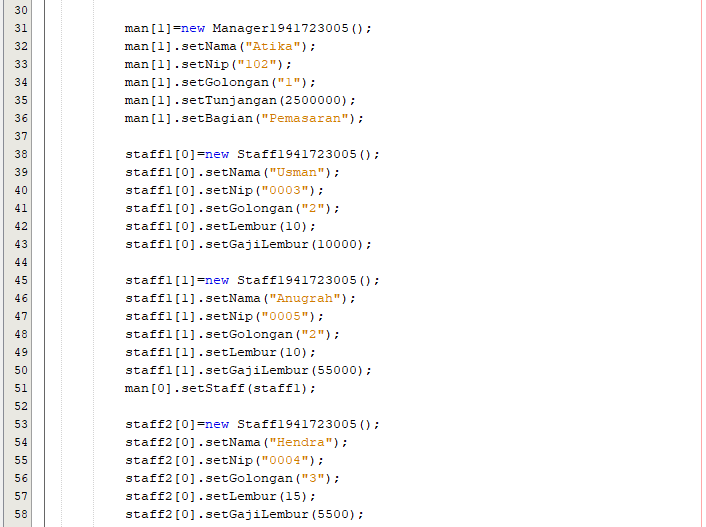

# Laporan Praktikum #7 - Overloading dan Overriding

## Kompetensi

Setelah menempuh pokok bahasan ini, mahasiswa mampu :
1. Memahami konsep overloading dan overriding,
2. Memahami perbedaan overloading dan overriding,
3. Ketepatan dalam mengidentifikasi method overriding dan overloading
4. Ketepatan dalam mempraktekkan instruksi pada jobsheet
5. Mengimplementasikan method overloading dan overriding.

## Ringkasan Materi

## Percobaan 1
    Untuk kasus contoh berikut ini, terdapat tiga kelas, yaitu Karyawan, Manager, dan Staff. Class Karyawan merupakan superclass dari Manager dan Staff dimana subclass Manager dan Staff memiliki method untuk menghitung gaji yang berbeda.


link kode program : [Karyawan1941723005.java](../../src/7_Overriding_dan_Overloading/Karyawan1941723005.java)


link kode program : [Manager1941723005.java](../../src/7_Overriding_dan_Overloading/Manager1941723005.java)


link kode program : [Staff1941723005.java](../../src/7_Overriding_dan_Overloading/Staff1941723005.java)


link kode program : [Utama1941723005.java](../../src/7_Overriding_dan_Overloading/Utama1941723005.java)





## Latihan

link kode program : [PerkalianKu1941723005.java](../../src/7_Overriding_dan_Overloading/PerkalianKu1941723005.java)


1. Dari source coding diatas terletak dimanakah overloading?
2. Jika terdapat overloading ada berapa jumlah parameter yang berbeda?

link kode program : [PerkalianKu21941723005.java](../../src/7_Overriding_dan_Overloading/PerkalianKu1941723005.java)


3. Dari source coding diatas terletak dimanakah overloading?
4. Jika terdapat overloading ada berapa tipe parameter yang berbeda?

link kode program : [Ikan1941723005.java](../../src/7_Overriding_dan_Overloading/PerkalianKu1941723005.java)


link kode program : [Piranha1941723005.java](../../src/7_Overriding_dan_Overloading/PerkalianKu1941723005.java)


link kode program : [Fish1941723005.java](../../src/7_Overriding_dan_Overloading/PerkalianKu1941723005.java)


5. Dari source coding diatas terletak dimanakah overriding?
6. Jabarkanlah apabila sourcoding diatas jika terdapat overriding?

## Jawaban

1. Overload terletak pada:
```java
void perkalianFikrul(int a, int b) {
    System.out.println(a * b);
}
//oveloading perbedaan jumlah parameter
void perkalianFikrul(int a, int b, int c) {
    System.out.println(a * b * c);
}
```

2. Ada 1 (satu) jumlah parameter yang berbeda, yaitu:
```java
int c
```

3. Overload terdapat pada:
```java
void perkalianFikrul(int a, int b) {
    System.out.println(a * b);
    }
//overloading perbedaan tipe data parameter 
void perkalianFikrul(double a, double b) {
    System.out.println(a * b);
}
```

4. Ada 2 (dua) yaitu:
```java
double a, double b
```

5. Override terletak pada:
```java
//overriding method parent class
@Override
public void swimFikrul() {
    System.out.println("Piranha bisa makan daging");
}
```

6. Subclass tidak dapat mengimplementasikan method swimFikrul() yang merupakan polimorfisme dari swimFikrul() yang ada pada superclass sehingga akan error jika tidak override.

## Tugas

### 1. Overloading

link kode program : [Segitiga1941723005.java](../../src/7_Overriding_dan_Overloading/PerkalianKu1941723005.java)


link kode program : [SegitigaMain1941723005.java](../../src/7_Overriding_dan_Overloading/PerkalianKu1941723005.java)


## 2. Overriding

link kode program : [Manusia1941723005.java](../../src/7_Overriding_dan_Overloading/PerkalianKu1941723005.java)


link kode program : [Dosen1941723005.java](../../src/7_Overriding_dan_Overloading/PerkalianKu1941723005.java)


link kode program : [Mahasiswa1941723005.java](../../src/7_Overriding_dan_Overloading/PerkalianKu1941723005.java)


link kode program : [ManusiaMain1941723005.java](../../src/7_Overriding_dan_Overloading/PerkalianKu1941723005.java)


