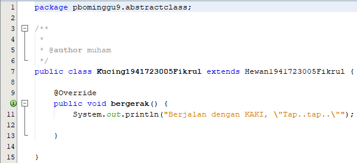
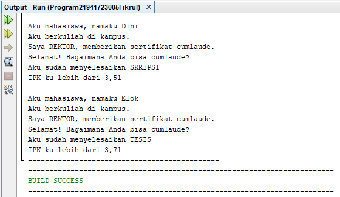

# Laporan Praktikum #9 ‑ Abstract Class dan Interface

## Kompetensi

1. Menjelaskan maksud dan tujuan penggunaan Abstract Class;
2. Menjelaskan maksud dan tujuan penggunaan Interface;
3. Menerapkan Abstract Class dan Interface di dalam pembuatan program.

## Ringkasan Materi

## Praktikum
### Percobaan 1: Abstract Class

link kode program : [Hewan](../../src/9_Abstract_Class_dan_Interface/Hewan1941723005Fikrul.java)

link kode program : [Kucing](../../src/9_Abstract_Class_dan_Interface/Kucing1941723005Fikrul.java)

link kode program : [Ikan](../../src/9_Abstract_Class_dan_Interface/Ikan1941723005Fikrul.java)

link kode program : [Orang](../../src/9_Abstract_Class_dan_Interface/Orang1941723005Fikrul.java)

link kode program : [MainProgram1](../../src/9_Abstract_Class_dan_Interface/Program1941723005Fikrul.java)

### Pertanyaan
Bolehkah apabila sebuah class yang meng-extend suatu abstract class tidak mengimplementasikan method abstract yang ada di class induknya? Buktikan!

### Jawab
Tidak boleh

### Percobaan 2: Interface

link kode program : [ICumlaude](../../src/9_Abstract_Class_dan_Interface/ICumlaude1941723005Fikrul.java)

link kode program : [Mahasiswa](../../src/9_Abstract_Class_dan_Interface/Mahasiswa1941723005Fikrul.java)

link kode program : [Sarjana](../../src/9_Abstract_Class_dan_Interface/Sarjana1941723005Fikrul.java)

link kode program : [PascaSarjana](../../src/9_Abstract_Class_dan_Interface/PascaSarjana1941723005Fikrul.java)

link kode program : [Rektor](../../src/9_Abstract_Class_dan_Interface/Rektor1941723005Fikrul.java)

link kode program : [MainProgram2](../../src/9_Abstract_Class_dan_Interface/Program21941723005Fikrul.java)

### Pertanyaan

a. Mengapa pada langkah nomor 9 terjadi error? Jelaskan!

b. Dapatkah method kuliahDiKampus() dipanggil dari objek sarjanaCumlaude di class Program? Mengapa demikian?

c. Dapatkah method kuliahDiKampus() dipanggil dari parameter mahasiswa di method beriSertifikatCumlaude() pada class Rektor? Mengapa demikian?

d. Modifikasilah method beriSertifikatCumlaude() pada class Rektor agar hasil eksekusi class Program menjadi seperti berikut ini:

### Jawab

a. Karena kelas Mahasiswa harus mengimplements interface ICumlaude terlebih dahulu agar method pada kelas Rektor yang memuat ICumlaude                    
        mahasiswa.lulus();
        mahasiswa.meraihIPKTinggi(); 

dapat dijalankan

b. Dapat, karena telah meng-extends Mahasiswa yang memiliki method kuliahDiKampus()

c. Tidak dapat karena Rektor tidak  meng-extends Class yang memiliki method kuliahDiKampus()

d. 

### Percobaan 3: Multiple Interfaces Implementation

## Kesimpulan

## Pernyataan Diri

Saya menyatakan isi tugas, kode program, dan laporan praktikum ini dibuat oleh saya sendiri. Saya tidak melakukan plagiasi, kecurangan, menyalin/menggandakan milik orang lain.

Jika saya melakukan plagiasi, kecurangan, atau melanggar hak kekayaan intelektual, saya siap untuk mendapat sanksi atau hukuman sesuai peraturan perundang-undangan yang berlaku.

Ttd,

***(Muhammad Fikrul Haqi)***